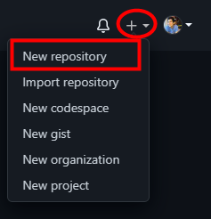
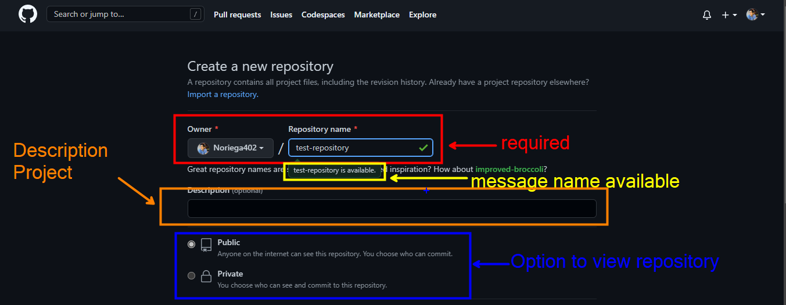
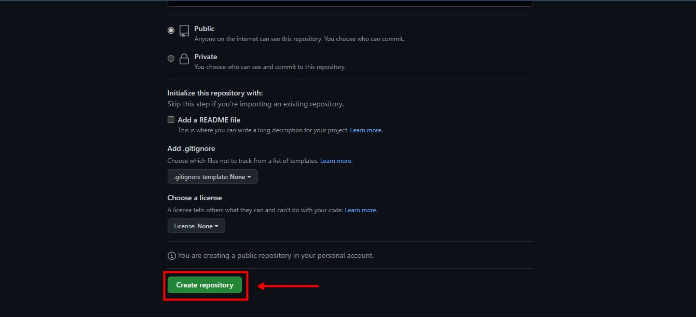
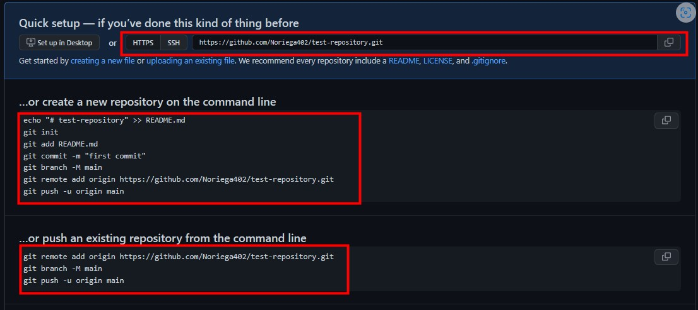

# Table of contents

- [Setting up your git bash](#setting-up-your-git-bash)
- [Initialize local repository](#initialize-a-repository-locally)
- [Commands](#otrosComandos)
  - [git push](#git-push)
    - [git push standard](#push-standard)
    - [git push --force](#push-force)
    - [git push --all](#push-all)
    - [git push --tags](#push-tags)
  - [git commit](#git-commit)
    - [-m](#commit-m)
    - [-am](#commit-am)
    - [--amend](#commit-amend)
    - [--no-edit](#commit-no-edit)
  - [git clone](#git-clone)
    - [--branch](#git-clone-branch)
  - [git diff](#git-diff)
    - [diff file](#diff-file)
    - [diff compare files](#diff-hash)
  - [git rm](#git-rm)
    - [rm](#-r)
    - [--cached](#--cached)
    - [-rf](#-rf)
  - [git log](#git-log)
    - [--oneline](#--oneline)
    - [--stat](#--stat)
    - [--patch](#--patch)
    - [--graph](#--graph)
    - [Practice joins](#joins-log)
  - [git brach](#git-branch)
    - [View local branches](#view-local-branches)
    - [View all branches](#view-all-branches)
    - [-v](#-v)
  - [Create new branch](#new-branch)
    - [checkout](#checkout)
    - [Rename branches](#rename-branches)
    - [Delete branches](#delete-branches)
  - [git stash](#git-stash)
    - [List items in the stash](#items-stash)
    - [Get elements from stash](#get-elements-stash)
    - [Create new branch with stash](#stash-with-branch)
    - [Removing element from the stash](#remove-elements-stash)
  - [git clean](#git-clean)
    - [Simulate a file deletion](#simulate-file-deletion)
    - [Delete the files listed as not to be tracked](#delete-files-tracked)
    - [Delete the folders listed as not to be tracked](#delete-folder-no-tracked)
  - [git reflog](#git-reflog)
  - [git reset](#git-reset)

## Setting up your git bash

The first steps is to find the _git bash_ application that you installed previously

After running git bash you will have to configure it with your GitHub __user name__ and __email address__ like this.
```bash
git config --global user.name "your username"
```
```bash
git config --global user.email "your email"
```

To confirm that your data was successfully saved you can execute one of the following commands.

__NOTE:__ some give more information than others.
```bash
git config --global --list
```
```bash
git config --list
```

## Initialize a repository locally
```bash
  git init
```
View the status of modified files
```bash
  git status
```
To add a file to the stage we use the following command
```bash
  git add <name-file>
```
To add to the stage all the files that have been edited, use the following command
```bash
  git add .
```
Perform a commit (code capture) with a message about the changes that were made
```bash
  git commit -m "Message commit"
```
If we want to skip the two previous commands ( _git add_, _git commit -m_ ) we can do the following, it is like watching a shorthand
```bash
  git commit -am "Message commit"
```
It is possible to remove them in several ways, either by deleting the file from the folder, but it may not always be so because maybe that file only added a couple of new lines or that file had to be added in a separate commit, then git makes it easy to remove that file from the staging area with this command:
```bash
  git restore --staged <name-file>
```
Now we will have to create a git repository to be able to add our project
<br>

1.  Click on the "new repository" option



2.  A name is required for the repository, so we insert one, GitHub is responsible for seeing if that name we have already used before, if not if it validates the repository name field

__NOTE:__ The repository view option must be public, otherwise no one will be able to see our project




3.   Click create repository



A space like this will appear:



- The first box is to connect by https or SSH to our repository, for the moment it will only be by https.
- The second table gives us some of the commands already mentioned above and some new ones that we will mention later.
- The last table is similar to the second with the difference that if the repository already existed there is no need to do more extra steps.

The following command is to create a README file to our project (if necessary) otherwise we can skip this step:
```bash
  echo "# test-repository" >> README.md
```
To create the main branch in our project you need mandatory use of the following command because the __" -M "__ option is to force it to move to the main branch
```bash
  git branch -M main
```

Now we add the path in which our staging area will connect to our remote repository through this command

<pre>FOR EXAMPLE: git remote add origin https://github.com/Noriega402/test-repository.git</pre>

```bash
  git remote add origin url
```
Finally we make all changes or new files are uploaded to our repository on GitHub:
```bash
  git push -u origin main
```
Once these steps have been done we can go to our repository on GitHub and refresh the page.

<h3 id="otrosComandos">Other commands</h3>
<h4 id="git-push">git push</h4>
<h5 id="push-standard">standard</h5>

The most commonly used to upload the first commit
```bash
git push -u origin <branch-name>
```

<h5 id="push-force">--force</h5>
To forcibly upload changes
```bash
git push -f
```

__NOTE:__ Do not use the -f flag unless you are absolutely sure of what you are doing. It can cause a lot of problems.

<h5 id="push-all">--all</h5>

To upload all the changes you made in all the branches.

```bash
git push --all
```

<h5 id="push-tags">--tags</h5>

To upload all the tags you have created.

```bash
git push --tags
```

<h4 id="git-commit">git commit</h4>

<h5 id="commit-m">-m</h5>
To be able to create a commit message without using a code editor

```bash
git commit -m "Your message commit"
```

<h5 id="commit-am">-am</h5>
In addition to including the commit message, this option allows you to skip the staging phase. The addition of -a will automatically stage any files that are already being tracked by Git (changes to files that you've committed before).

```bash
git commit -am "Your message commit"
```

<h5 id="commit-amend">--amend</h5>

Most of the time it happens to us for the commit message we write it wrong, then this command helps us to correct the commit again.

```bash
  git commit --amend -m "Fixed commit message"
```

<h5 id="commit-no-edit">--no-edit</h5>

In case we forget to add a file or folder to a commit, we can also add it this way with a new option and there is no need to edit the commit message or add a new one:

```bash
  git add name-file
```
```bash
  git commit --amend --no-edit
```

<h4 id="git-clone">git clone</h4>
<h5 id="git-clone-branch">--branch</h5>

Use it to be able to clone a specific branch of a repository.

```bash
git clone --branch <nameBranch> <urlResporitory>
```

Example:

<pre>git clone --branch docker https://github.com/Noriega402/Node-API-REST.git</pre>

or the short form:

```bash
git clon -b <nameBranch> <urlResporitory>
```

<h4 id="git-diff">git diff</h4>
<h5 id="diff">diff</h5>

It is used to be able to see in console the changes made, either we delete or add new lines of code
```bash
  git diff
```

<h5 id="diff-file">diff "file" </h5>

We can use it to see the changes made in a single file
```bash
  git diff <name-file>
```

<h5 id="diff-hash">diff hash-old hash-new</h5>

We can use it to see the changes made between one commit and another
```bash
  git diff <hash-commit-old> <hash-commit-new>
```

<h4 id="git-rm">git rm</h4>

You have several options which are as follows:

<h5 id="-r">-r</h5>

- Gives permission to delete recursively within a folder
```bash
  git rm -r
```

<h5 id="--cached">--cached</h5>

- To remove changes added to the stagin area.
```bash
  git rm --cached name-file
```

<h5 id="-rf">-rf</h5>

- To forcibly delete a folder
```bash
  git rm -rf name-folder
```

<h4 id="git-log">git --log</h4>

We have many changes or commit in our repository, as the project gets bigger, my project will have more commits, the good thing about this is that each commit has a message to know what changes were made, but how to see the name of those messages and see the hash of each one, we have several ways:
- To view changes in an extended way. By default it displays the following fields
  - Secure Hash Algorithm (SHA).
  - Author.
  - Date.
  - Commit message.
```bash
  git log
```

<h5 id="--oneline">--oneline</h5>

- A simple and easy way to read
  -  Displays one commit per line.
  -  the first 7 characters of the hash (SHA).
  -  The commit message.
```bash
  git log --oneline
```

<h5 id="--stat">--stat</h5>

- This option causes the following results:
  - Displays the files that were modified in each commit.
  - View the number of lines added or removed in files.
  - A summary line with the total number of files and lines modified.
```bash
  git log --stat
```

<h4 id="--patch">--patch</h4>

- There is a shorter version instead of writing --patch, you can with -p and this displays the following on the screen:
  - The files you've modified.
  - The location of the lines you've added or removed.
  - Los cambios específicos que ha realizado.
- Extensive version
```bash
  git log --patch
```
- Short version
```bash
  git log -p
```

<h4 id="--graph">--graph</h4>

- Allows you to view the history of commits by means of a small graph
```bash
  git log --graph
```

<h4 id="joins-log">joins log</h4>

- Most of these commands can be merged into a single line, I invite you to practice them or discover them for yourself.
```bash
  git log --graph
```
```bash
  git log --oneline --graph
```
```bash
  git log --oneline --graph --decorate
```
```bash
  git log --oneline --stat
```
```bash
  git log --oneline -p
```

<h4 id="git-branch">git branch</h4>
<h5 id="branch">branch</h5>

#### View local branches
- You can see all branches in your repository.
```bash
  git branch
```

#### View all branches
- To view your repository branches
```bash
  git branch -a
```

<h5 id="-v">-v</h5>

- View branches with their last commit (hash and message).
```bash
  git branch -v
```

<h4 id="new-branch">New branch</h4>
<h5 id="new-name-branch">New name branch</h5>

- To create a new branch in the repository
```bash
  git branch development
```

<h4 id="checkout">checkout</h4>

- To change branches
```bash
  git checkout name_branch
```
There is a shortcut to create and move branches in the repository.
```bash
  git checkout -b new-name-branch
```

<h4 id="rename-branches">Rename branches</h4>
<h5 id="-r">--move</h5>

Form One
```bash
  git branch --move old-name-branch  new-name-branch
```
Form Two
```bash
  git branch -m old-name-branch  new-name-branch
```

<h4 id="delete-branches">Deleting branches</h4>
<h5 id="-d">-d</h5>

```bash
  git checkout main
  git branch -d development
  git branch
```

<h4 id="git-stash">git stash</h4>

Saves the current Staging job in a list designed to be temporary called Stash, so that it can be retrieved in the future. To add the changes to the stash, use the command:
```bash
git stash
```
We can put a message in the stash, in order to differentiate them in the git stash list in case we have several elements in the stash. This with:
```bash
git stash save "Your messagge to stash"
```

<h4 id="items-stash">list of items in the stash</h4>

To see the list of changes saved in Stash and thus be able to retrieve them or do something with them we can use the command:

```bash
  git stash list
```

<h4 id="get-elements-stash">Get elements from the stash</h4>

The stashed behaves like a data Stack behaving in a LIFO (Last In, First Out) way, so we can access the pop method.

The pop method will retrieve the last stashed state from the list and insert it into the staging area, so it is important to know which branch you are in to be able to retrieve it, since the stash will be agnostic to the branch or state you are in. It will always retrieve the changes you made in the place you call it.

- To retrieve the latest changes from the stash to your staging area use the command:
  ```bash
  git stash pop
  ```
- To apply changes to a specific stash and remove it from the stash:
```bash
  git stash pop stash@{<num_stash>}
  ```
 - To resume the changes of a specific Stash position you can use the command:
 ```bash
  git stash apply stash@{<num_stash>}
  ```
 __NOTE:__ the <num_stash> you get it from the git stash list


<h4 id="stash-with-branch">Creating a branch with the stash</h4>

To create a branch and apply the most recent stash we can use the command:

```bash
git stash branch <branch_name>.
```
If you want to create a branch and apply a specific stash (obtained from git stash list) you can use the command:
```bash
git stash branch branch_name stash@{<num_stash>}
```
By using these commands you will create a branch with the name <branch_name>, move to it and have the specified stash in your staging area.

<h4 id="remove-elements-stash">Removing element from the stash</h4>

To remove the most recent changes within the stash (element 0), we can use the command:

```bash
git stash drop
```
But if, instead, you know the index of the stash you want to delete (via git stash list) you can use the command:
```bash
git stash drop stash@{<num_stash>}
```
Where the <num_stash> is the index of the saved change.


<h4 id="git-clean">git clean</h4>

If, on the other hand, you want to remove all elements from the stash, you can use:

```bash
git stash clear
```
Executing the default command may result in an error. Git's global configuration forces the force option to be used with the command for it to be effective. This is an important safety mechanism as this command cannot be undone.

__NOTE:__ git clean only detects new files, not just repeated files.


<h4 id="simulate-file-deletion">Simulate a file deletion</h4>

```bash
git clean --dry-run
```

<h4 id="delete-files-tracked">Delete the files listed as not to be tracked.</h4>

```bash
git clean -f
```

<h4 id="delete-folder-no-tracked">Delete the folders listed as not to be tracked</h4>

```bash
git clean -df
```

<h4 id="git-reflog">git reflog</h4>

Git saves all changes even if you decide to delete them, by deleting a change what you are doing is just updating the branch tip, to manage these tips there is a mechanism called reference logs or reflogs...The management of these changes is through the reference (or ref) hash's which are pointers to the commits...The hash's record when the Git references were updated in the local repository (local only), so if you want to see how you have modified the history you can use the command:
```bash
git reflog
```

<h4 id="git-reset">git reset</h4>

- __soft:__ when the --soft argument is passed, the reference pointers are updated and the reset stops there. The staging environment index and working directory remain intact. It may be difficult to clearly demonstrate this behavior.

__NOTE:__  with soft, deleted files are not recovered, they just remain deleted in staging.

  ```bash
  git reset --soft <hash-commit>
  ```

- __--hard:__ This is the most direct, DANGEROUS and usual option. When --hard is passed, the commit history reference pointers are updated to the specified commit. The staging environment index and working directory are then reset to reflect the specified commit. All previous pending changes to the staging environment index and working directory are reset to reflect the state of the commit tree. This means that any pending work left in the staging environment index and working directory will be lost.

__Note:__ with hard if the files are recovered inside our computer, as if they had never been deleted.
  ```bash
  git reset --hard <hash-commit>
  ```
